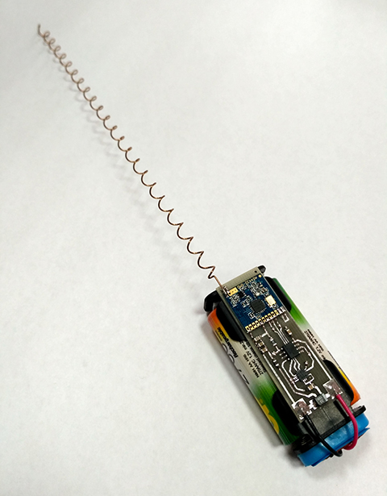
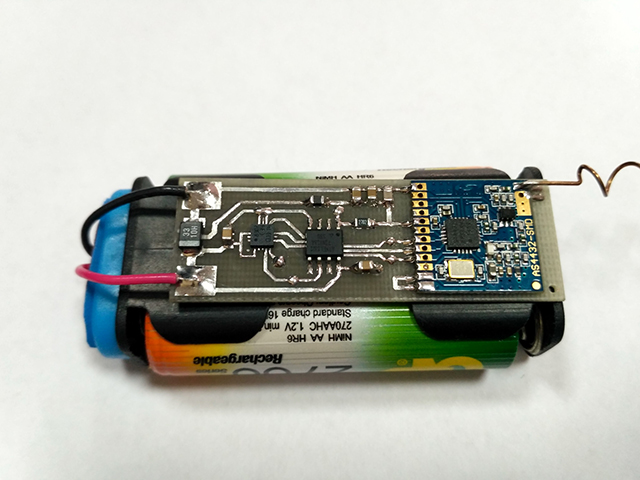
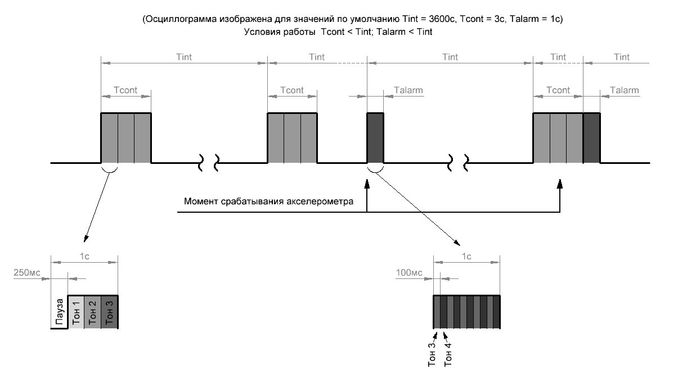
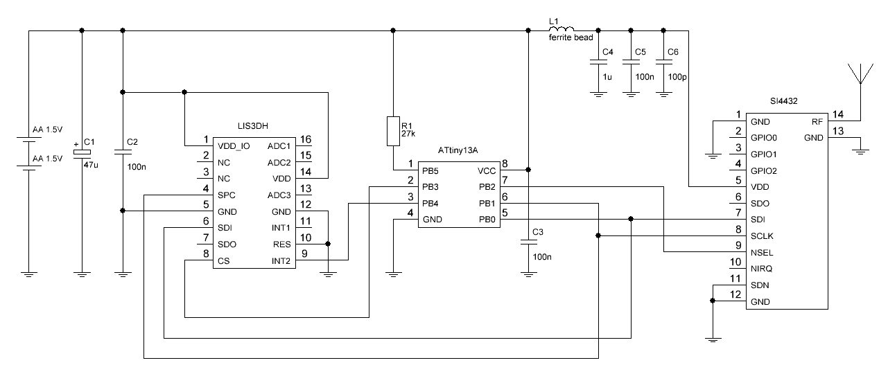
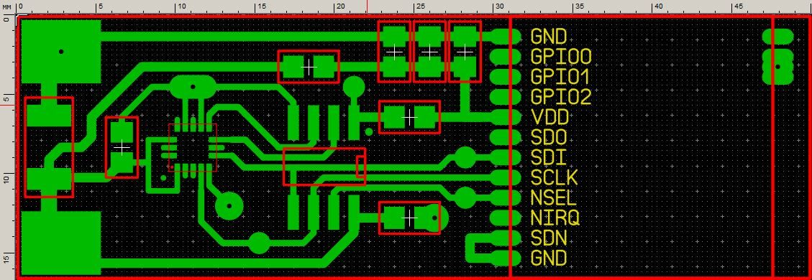
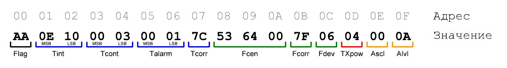
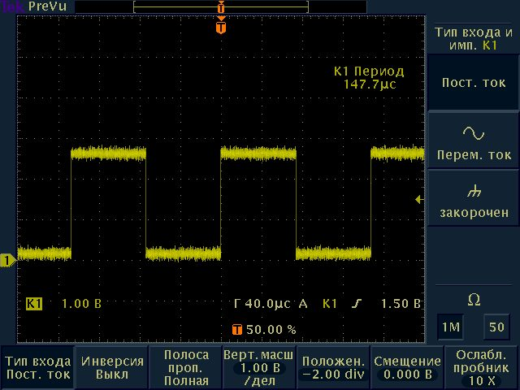
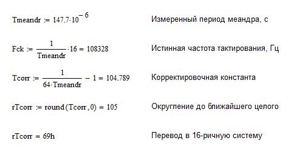

# alrarm_beacon_with_accelerometer
Охранный радиомаяк с акселерометром

Видео: https://www.youtube.com/watch?v=IjiarS18jRc

***

**Радиомаяк предназначен для:**

* контроля перемещения объектов (автомобиль, велосипед, чемодан)
* контроля действий (открытие двери, разбитие стекла)
* контроля передвижения (охрана периметра с растяжкой)

***

**Принцип работы:**

После включения а затем периодически (спустя Tint) радиомаяк излучает в эфир контрольные сигналы (длительностью Tcont). При срабатывании акселерометра в эфир излучается аварийный сигнал (длительностью Talarm). Интервал контрольного сигнала Tint, длительность контрольного сигнала Tcont и длительность аварийного сигнала Talarm настраиваются. Контрольный сигнал представляет собой три последовательных тона с паузой, аварийный сигнал представляет собой двухтоновую сирену. Прием осуществляется на сканер или рацию в режиме ЧМ. 

***

**Технические характристики:** 
* Напряжение питания: 1.8 В ~ 3.3 В
* Рабочий диапазон частот: LPD 433
* Тип модуляции: ЧМ, УЧМ, ШЧМ
* Девиация частоты: 625 Гц ~ 159 кГц
* Выходная мощность: +1 dBm ~ +20 dBm
* Интервал контрольного сигнала: 1 с ~ 65535 с
* Длительность контрольного сигнала: 1 с ~ 65535 с
* Длительность аварийного сигнала: 1 с ~ 65535 с
* Пределы чувствительности акселерометра: 2g, 4g, 8g, 16g
* Шаг настройки чувствительности акселерометра: 16mg@2g, 32mg@4g, 62mg@8g, 186mg@16g

***

**Схема:**

Принципиальная схема содержит минимум пассивных элементов и сравнительно легкодоступные микросхемы: известный микроконтроллер ATTiny13A, недорогой акселерометр LIS3DH и популярный модуль SI4432. 

***

**Печатная плата:**

Печатная плата двухсторонняя. Обратная сторона - сплошная земля. Все 5 имеющихся отверстий - переходные на землю. Минимальная ширина дорожек 0.35 мм, что под силу для ЛУТ.

***

**Настройка:**

Настройка параметров осуществляется путем изменения значений в соответствующих ячейках энергонезависимой памяти EEPROM. 

 
* **Flag** - ячейка-флаг записи значений по умолчанию
* **Tint** - интервал контрольного сигнала (0x0E10 = 3600 c)
* **Tcont** - длительность контрольного сигнала (0x0003 = 3 c)
* **Talarm** - длительность аварийного сигнала (0x0001 = 1 c)
* **Tcorr** - корректировка временных задержек микроконтроллера (0x7C = 124)
* **Fcen** - центральная частота SI4432 (0x536400 = 434 МГц)
* **Fcorr** - корректировка частоты кварца SI4432
* **Fdev** - девиация частоты SI4432 (0x06 = 3750 Гц)
* **TXpow** - мощность передатчика SI4432 (0x04 = +11 dBm)
* **Ascl** - предел шкалы акселерометра (0x00 = 2g)
* **Alvl** - уровень срабатывания акселерометра (0x0A = 160mg)

***

**Пояснения:**

1) Запись любого значения отличного от 0xAA в ячейку Flag приведет к перезаписи всех настроек значениями по умолчанию. Значение по умолчанию ячеек EEPROM равняется 0xFF, поэтому после первого включения память будет проинициализирована значениями по умолчанию.

2) Параметры Tint, Tcont, Talarm записываются в формате big-endian, т.е. сначала старший байт, затем младший. Условие работоспособности системы: длительность контрольного сигнала Tcont и длительность аварийного сигнала Talarm  должны быть меньше интервала контрольного сигнала Tint. Срабатывание акселерометра всегда сбрасывает счетчик Tint, т.о. после аварийного сигнала параметр Tint начнет отсчитываться заново. Если акселерометр сработал во время воспроизведения контрольного сигнала, то аварийный сигнал воспроизведется сразу после завершения воспроизведения контрольного сигнала.

3) Так как внутренний 128 кГц осциллятор ATTiny13A не отличается стабильностью частоты, была реализована функция корректировки временных задержек. После подачи напряжения питания в течении 4 секунд на 5 ножке (PB0) ATTiny13A генерируется меандр с частотой Fmeandr=Fck/16, где Fck истинная частота тактирования микроконтроллера. Необходимо измерить осциллографом период этого сигнала Tmeandr=1/Fmeandr и подставить его в выражение для вычисления корректирующей константы __Tcorr = (1/(64 x Tmeandr))-1__. Округление выполнять до ближайшего целого. Значение по умолчанию соответствует истинной частоте равной 128 кГц. В реальных микроконтроллерах истинная частота обычно меньше и в зависимости от партии составляет 100-120 кГц, поэтому требуется подстройка.

*Например, расчет для моего случая*

4) Центральная частота рассчитывается с помощью формул приведенных в даташите SI4432 или с помощью удобного калькулятора Si443x-Register-Settings_RevB1. Ячейки Fcen слева направо соответствуют регистрам SI4432 0x75-0x77.

5) Корректировка частоты кварца SI4432 регулирует нагрузочную емкость последнего. Настройка этого параметра позволяет более точно подогнать частоту передачи, например чтобы использовать для приема стандартную LPD говорилку. Ячейка Fcorr соответствует регистру SI4432 0x09. Подробнее в даташите.

6) Девиация частоты передатчика задается множителем Fdev по формуле: Девиация в Гц = 625 Гц x Fdev. Настройка этого параметра позволяет подстроится под полосу пропускания вашего приемника, иными словами выбрать УЧМ или ШЧМ. Соответствует регистру SI4432 0x72.

7) Мощность передатчика задается восемью уровнями от +1 dBm до +20 dBm:
   * TXpow = 0, мощность +1 dBm
   * TXpow = 1, мощность +2 dBm
   * TXpow = 2, мощность +5 dBm
   * TXpow = 3, мощность +8 dBm
   * TXpow = 4, мощность +11 dBm
   * TXpow = 5, мощность +14 dBm
   * TXpow = 6, мощность +17 dBm
   * TXpow = 7, мощность +20 dBm

8) Выбор шкалы акселерометра определяет максимальное ускорение которое он способен измерить. При этом речь идет об отклонении(ускорении) как в положительную область так и в отрицательную. Здесь g это ускорение свободного падения.
   * Ascl = 0, предел +-2g
   * Ascl = 1, предел +-4g
   * Ascl = 2, предел +-8g
   * Ascl = 3, предел +-16g

9) Параметр Alvl задает чувствительность срабатывания сигнализации. Шаг задания чувствительности (квант) зависит от текущего значения Ascl. Здесь mg это одна тысячная g.
   * При Ascl = 0, квант Alvl = 16mg
   * При Ascl = 1, квант Alvl = 32mg
   * При Ascl = 2, квант Alvl = 62mg
   * При Ascl = 3, квант Alvl = 186mg

10) Для удобства генерации .eep файла прикладываю листинг настроек на ассемблере, изменяйте его содержимое, компилируйте и прошивайте в мк.

***

**Потребление при питании от 3 В:**

* Ток потребления в режиме излучения зависит от выбранной мощности передачи. Так при +11 dBm (13 мВт) ток потребления составляет 25 мА. При максимальной мощности +20 dBm (100 мВт) ток потребления составляет ~85 мА. 
* Ток потребления в простое складывается из четырех составляющих. Ток потребления микроконтроллера (~10 мкА), ток потребления трансивера (~1 мкА), ток потребления акселерометра(~10 мкА) и ток потребления системы BOD микрокотроллера (~20 мкА). Итого суммарный ток потребления в простое не превышает 50 мкА. 
* В режиме ожидания, с настройками по умолчанию (3 секунды контрольного сигнала в час, без срабатываний сигнализации, +11 dBm мощности) от двух батареек АА емкостью 1 Ач устройство проработает больше 1 года (средний ток потребления 70 мкА).
* Ток в простое можно существенно сократить отключив BOD, но я как автор не советую этого делать при батарейном питании. Система BOD позволяет существенно снизить вероятность порчи настроек в памяти EEPROM при достижении минимального напряжения питания (1.8 В).
* Кстати о напряжении питания. Минимальное 1.8 В, однако есть ограничение со стороны микросхемы РЧ переключателя upg2179tb установленного на плате модуля SI4432. Минимальное напряжение питания upg2179tb - 2.5 В. Так как модуль работает только на передачу, целесообразным было бы демонтировать эту микросхему а вместо нее кинуть перемычку между цепью TX SI4432 и антенной. Тогда можно питать от батареек АА до почти полного их разряда, да и мощность подрастет (минус потери в РЧ ключе). Я данную манипуляцию еще не производил.

***

**Прошивка:**

Прошивать можно прям в схеме, после сборки. Для этого на плате расположены 4 пятачка для контактов программатора (их названия подсвечиваются при наведении на них мышью в Sprint Layout). Фьюзы настраиваем так: **Low = 0x73, High = 0xFD**. Эти фьюзы справедливы для AVRDUDE, и были рассчитаны с помощью онлайн калькулятора http://www.engbedded.com/fusecalc

***

**Файлы:**

Прошивка, графический материал, файл расчета корректирующей константы в маткад, файл eeprom и ассемблеровский листинг для генерации этого файла в AVR Studio 4.19, плата в Layout 6 и Excel калькулятор регистров SI4432.
